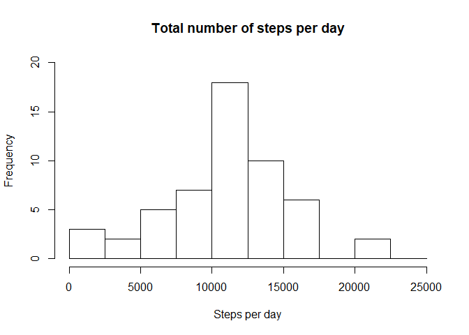
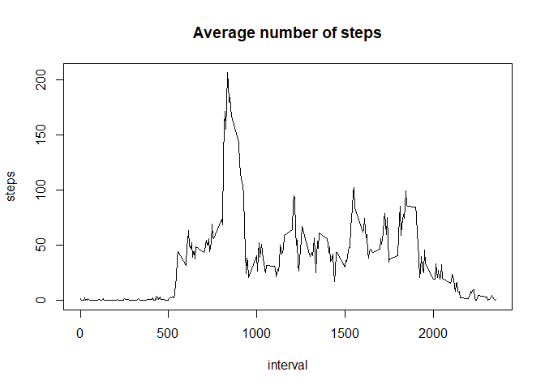
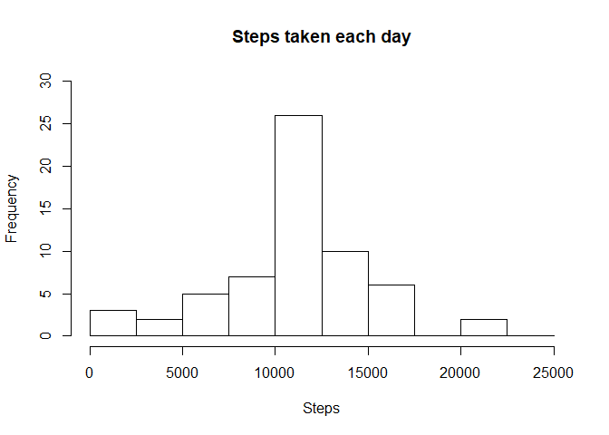
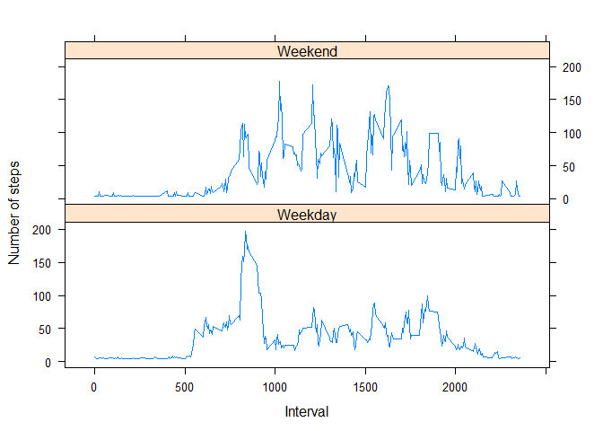

## Introduction

It is now possible to collect a large amount of data about personal movement using activity monitoring devices such as a Fitbit, Nike Fuelband, or Jawbone Up. These type of devices are part of the "quantified self" movement -- a group of enthusiasts who take measurements about themselves regularly to improve their health, to find patterns in their behavior, or because they are tech geeks. But these data remain under-utilized both because the raw data are hard to obtain and there is a lack of statistical methods and software for processing and interpreting the data.

This assignment makes use of data from a personal activity monitoring device. This device collects data at 5 minute intervals through out the day. The data consists of two months of data from an anonymous individual collected during the months of October and November, 2012 and include the number of steps taken in 5 minute intervals each day.

## Loading and preprocessing the data

```r
#library(lubridate)
unzip("./repdata_data_activity.zip")
data <- read.csv("./activity.csv")
head(data)
```

```
##   steps       date interval
## 1    NA 2012-10-01        0
## 2    NA 2012-10-01        5
## 3    NA 2012-10-01       10
## 4    NA 2012-10-01       15
## 5    NA 2012-10-01       20
## 6    NA 2012-10-01       25
```

```r
str(data)
```

```
## 'data.frame':	17568 obs. of  3 variables:
##  $ steps   : int  NA NA NA NA NA NA NA NA NA NA ...
##  $ date    : Factor w/ 61 levels "2012-10-01","2012-10-02",..: 1 1 1 1 1 1 1 1 1 1 ...
##  $ interval: int  0 5 10 15 20 25 30 35 40 45 ...
```

```r
#data$date <- ymd(data$date)
summary(data$steps)
```

```
##    Min. 1st Qu.  Median    Mean 3rd Qu.    Max.    NA's 
##    0.00    0.00    0.00   37.38   12.00  806.00    2304
```

## What is mean total number of steps taken per day?
1. Calculate the total number of steps taken per day
2. Make a histogram of the total number of steps taken each day
3. Calculate and report the mean and median of the total number of steps taken per day

```r
stepsPerDay <- aggregate(steps ~ date, data, sum, na.rm = TRUE)
hist(stepsPerDay$steps, main = "Total number of steps per day", xlab = "Steps per day",ylim = c(0,20),breaks = seq(0,25000, by=2500))
```

<!-- -->

```r
#Mean of the total number of steps taken per day
mean(stepsPerDay$steps)
```

```
## [1] 10766.19
```

```r
#Median of the total number of steps taken per day
median(stepsPerDay$steps)
```

```
## [1] 10765
```
## What is the average daily activity pattern?

1. Make a time series plot (i.e. \color{red}{\verb|type = "l"|}type = "l") of the 5-minute interval (x-axis) and the average number of steps taken, averaged across all days (y-axis)
2. Which 5-minute interval, on average across all the days in the dataset, contains the maximum number of steps?

```r
av_daily_act <- aggregate(steps~interval, data, mean, na.rm = TRUE )
plot(steps ~ interval, av_daily_act, type = "l", main="Average number of steps")
```

<!-- -->

```r
#Interval with mximum number of steps
av_daily_act[which.max(av_daily_act$steps),]$interval
```

```
## [1] 835
```

## Imputing missing values
Total number of missing values

```r
sum(is.na(data$steps))
```

```
## [1] 2304
```
New dataset that is equal to the original dataset but with the missing data filled in.

```r
data_fill <- data
data_fill$steps[is.na(data$steps)] <- round(mean(data$steps, na.rm = TRUE))
```
Histogram of the total number of steps taken each day

```r
stepsEachDay <- aggregate(steps ~ date, data_fill, sum)
hist(stepsEachDay$steps, main = "Steps taken each day", xlab = "Steps",ylim = c(0,30),breaks = seq(0,25000, by=2500))
```

<!-- -->
Mean and median total number of steps taken each day

```r
#Mean of the total number of steps taken each day
mean(stepsEachDay$steps)
```

```
## [1] 10751.74
```

```r
#Median of the total number of steps taken each day
median(stepsEachDay$steps)
```

```
## [1] 10656
```
 
Imputing missing data have a little impact on the median and the mean on the total number of steps taken each day.

## Are there differences in activity patterns between weekdays and weekends?
Create a new factor variable in the dataset with two levels -- "weekday" and "weekend" indicating whether a given date is a weekday or weekend day.

```r
data_fill$date <- as.Date(data_fill$date, format = "%Y-%m-%d")
data_fill$day <- weekdays(data_fill$date)
data_fill$dia <- as.factor(ifelse(data_fill$day == "sabado" | data_fill$day == "domingo","Weekend","Weekday"))
```
Make a panel plot containing a time series plot of the 5-minute interval (x-axis) and the average number of steps taken, averaged across all weekday days or weekend days (y-axis). See the README file in the GitHub repository to see an example of what this plot should look like using simulated data.

```r
activity_week_day <- aggregate(steps~interval + dia, data_fill, mean)
library(lattice)
head(activity_week_day)
```

```
##   interval     dia    steps
## 1        0 Weekday 6.603774
## 2        5 Weekday 5.226415
## 3       10 Weekday 5.018868
## 4       15 Weekday 5.037736
## 5       20 Weekday 4.962264
## 6       25 Weekday 6.000000
```

```r
xyplot(steps ~ interval | dia, activity_week_day, type = "l", layout = c(1, 2), xlab = "Interval", ylab = "Number of steps")
```

<!-- -->
